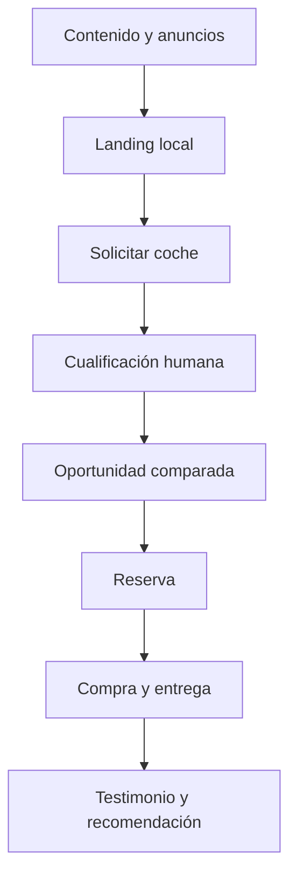

# PideTuCoche.eu
## Guía de implementación desde cero

**Versión:** 1.0 · 26 de agosto de 2026  
**Mercado inicial:** España · base de operaciones en Ourense  
**Marca:** PideTuCoche.eu · *Vehículos de ocasión bajo pedido*  
**Dirección visual:** Naranja Performance  
**Modelo:** B2C, compra profesional bajo reserva, sin inventario especulativo

> Este documento es la guía maestra para poner en marcha el negocio, encargar el producto digital y coordinar la operación. Las decisiones fiscales, jurídicas y contractuales deben ser validadas por asesores españoles antes de publicar o cobrar.

---

## 1. Decisión de negocio en una frase

PideTuCoche.eu recibe la necesidad concreta de un comprador, localiza un vehículo elegible en fuentes profesionales —inicialmente AUTO1.com—, calcula el coste total, obtiene una reserva condicionada, compra solo cuando la operación cumple los criterios y entrega el vehículo revisado mediante Ourense o un partner homologado.

### Lo que se promete al cliente

**“Tu próximo coche, bajo pedido: lo buscamos, lo revisamos y te lo entregamos.”**

### Lo que no se promete

- No se garantiza la adjudicación de una unidad antes de confirmarla.
- No se publican vehículos de subasta sin autorización de uso de datos o imágenes.
- No se puja automáticamente en el MVP.
- No se compra stock sin una reserva y margen aprobados.
- No se ocultan gastos: el precio final se desglosa antes de la reserva.

## 2. Alcance del MVP y definición de éxito

### Incluido en la primera versión

1. Web responsive con marca Naranja Performance.
2. Formulario de búsqueda de coche y presupuesto.
3. Catálogo de oportunidades cargado manualmente o por CSV autorizado.
4. Ficha de oportunidad con caducidad, estado, precio estimado y condiciones.
5. Comparador de hasta cuatro vehículos.
6. Reserva online, contrato, pago y reembolso controlado.
7. Portal de cliente para estado y documentos.
8. Backoffice para CRM, márgenes, compras, logística, incidencias y auditoría.
9. Portal básico de partner para recepción, checklist, fotos y entrega.
10. Notificaciones por email y enlaces operativos de WhatsApp.
11. RGPD, cookies, trazabilidad y copias de seguridad.

### Fuera del MVP

Scraping, API de AUTO1.com no autorizada, puja automática, marketplace multi-vendedor, financiación propia, tasación automática, aplicación nativa, múltiples países y franquicias.

### Definición de éxito a los 30 días

- El cliente puede solicitar y reservar una oportunidad desde móvil.
- El equipo puede convertir la reserva en expediente de compra sin hojas paralelas.
- Cada euro del precio tiene una fuente o una hipótesis registrada.
- Una operación puede pasar de reserva a entrega con estados y responsables.
- Se puede cancelar, reembolsar y auditar una operación de prueba.
- No se publica nada de AUTO1.com sin permiso documentado.

---

## 3. Gobierno del proyecto

| Rol | Responsabilidad principal | Decide sobre | Entregable semanal |
|---|---|---|---|
| Promotor / dirección | Visión, riesgo y aprobación | Alcance, precios, partners, contrataciones | Informe de decisiones |
| Inversor | Capital y control | Hitos de desembolso y reporting | Revisión financiera |
| Agencia de desarrollo | Producto, código, despliegue | Soluciones técnicas dentro del alcance | Demo y registro de incidencias |
| Asesor legal/fiscal | Contratos, consumo, RGPD, impuestos | Textos legales y estructura | Dictamen de salida |
| Comprador profesional | Selección y puja manual | Compra, puja máxima, descarte | Hoja de compra justificada |
| Operaciones Ourense | Flujo físico y atención | Preparación y entrega base | Checklist de vehículo |
| Partner provincial | Recepción y entrega local | Incidencia física dentro de SLA | Acta y fotos de entrega |
| Transporte | Traslado y prueba de entrega | Recogida/entrega | Albarán y trazabilidad |

### Cadencia obligatoria

- **Diaria, 15 min:** operaciones, compras y desarrollo durante el lanzamiento.
- **Semanal, 60 min:** dirección, agencia, legal y finanzas; se aprueban bloqueos.
- **Mensual:** resultados, caja, margen, reclamaciones, seguridad y roadmap.

Toda decisión que cambie precio, garantía, devolución, fuente de vehículos o tratamiento de datos queda registrada con fecha, autor y motivo.

---

## 4. Paso 0 — Congelar decisiones antes de construir (días 1–3)

### Acciones

1. Confirmar la sociedad operadora y quién será el vendedor frente al consumidor.
2. Confirmar PideTuCoche.eu como marca comercial y comprar dominios equivalentes relevantes.
3. Confirmar base en Ourense y piloto: Galicia más un partner de otra provincia.
4. Fijar el modelo económico: el cliente reserva; la sociedad compra; el partner presta servicio.
5. Fijar una reserva inicial configurable por segmento y una política de reembolso.
6. Aprobar un margen mínimo por operación y un límite de puja.
7. Aprobar presupuesto de lanzamiento de **150.000 €** como escenario de trabajo.
8. Aprobar la regla de beneficio: 50 % inversor / 50 % promotor sobre beneficio distribuible, con reserva de caja acordada.
9. Nombrar una sola persona con autoridad de producto y una sola de operaciones.
10. Firmar el encargo de alcance con la agencia.

### Entregables

- Acta de decisiones firmada.
- Matriz de riesgos inicial.
- Presupuesto por tramos.
- Documento de alcance MVP.
- Calendario de 30 días.

### Puerta de avance

No se empieza a programar hasta que estén aprobados vendedor, política de reserva, margen mínimo, fuente de vehículos y responsable de datos.

---

## 5. Paso 1 — Constituir y preparar la empresa (días 1–10)

### 5.1 Estructura recomendada

Validar con asesoría una **Sociedad Limitada española** como vehículo operativo. Debe poder comprar y vender vehículos, contratar transporte, mantenimiento, marketing, tecnología y partners, y facturar al consumidor.

### 5.2 Trámites y cuentas

1. Comprobar y reservar denominación social.
2. Preparar estatutos y objeto social.
3. Constituir mediante notaría y Registro Mercantil o CIRCE/PAE.
4. Obtener NIF y alta censal.
5. Abrir cuenta bancaria empresarial y cuenta separada para reservas si el asesor lo recomienda.
6. Contratar gestoría, seguro de responsabilidad civil y cobertura de prueba/traslado.
7. Configurar facturación, conciliación bancaria y archivo documental.
8. Definir poderes de firma y límites de compra.

El sistema CIRCE/PAE permite tramitar electrónicamente la creación o alta de empresas; debe comprobarse el procedimiento vigente con el PAE elegido ([PAE/CIRCE](https://paeelectronico.es/es-es/CreaEmpresaPorTiMismo/Paginas/CIRCE.aspx)). El tipo general del Impuesto sobre Sociedades es una referencia del 25 %, pero el resultado real depende de régimen, tamaño, fecha y circunstancias de la sociedad ([AEAT](https://sede.agenciatributaria.gob.es/Sede/impuesto-sobre-sociedades/que-base-imponible-se-determina-sociedades/tipo-impositivo.html)).

### 5.3 Paquete contractual mínimo

El asesor debe entregar versiones aprobadas de:

- Condiciones de uso y contratación B2C.
- Encargo de búsqueda y reserva condicionada.
- Política de cancelación, devolución y reembolso.
- Información de garantía legal aplicable al vehículo vendido.
- Política de privacidad, encargados y conservación.
- Política de cookies y gestión de consentimientos.
- Contrato marco con partner provincial.
- Contrato de transporte y prueba de entrega.
- Acuerdo de compra con fuentes profesionales.
- Acuerdo de confidencialidad y propiedad intelectual con la agencia.

Las ventas a distancia deben revisarse conforme a la normativa española de consumidores y usuarios, incluido el régimen de información y desistimiento que corresponda ([BOE, RDL 1/2007](https://www.boe.es/buscar/act.php?id=BOE-A-2007-20555)). La política de consentimiento debe seguir criterios de información, libertad, granularidad y prueba de la AEPD ([AEPD, consentimiento](https://www.aepd.es/preguntas-frecuentes/2-tus-obligaciones-como-responsable-del-tratamiento/5-bases-legitimadoras-del-tratamiento/FAQ-0211-segun-el-rgpd-como-debe-solicitarse-el-consentimiento-de-los-interesados)).

### 5.4 Regla de oro

La plataforma no debe redactar por sí sola una conclusión legal. Debe mostrar la versión del contrato aprobada, la fecha, el vendedor y el estado de aceptación.

---

## 6. Paso 2 — Diseñar la economía de cada operación (días 2–7)

### 6.1 Fórmula de precio

```text
Precio al cliente = compra o puja adjudicada
                 + transporte
                 + impuestos y tasas aplicables
                 + inspección y puesta a punto
                 + preparación documental
                 + coste del partner
                 + garantía/servicios contratados
                 + coste financiero esperado
                 + margen objetivo
```

El sistema debe separar **coste conocido**, **estimación**, **impuesto**, **margen** y **contingencia**. Ningún valor estimado puede presentarse como confirmado.

### 6.2 Ejemplo de control interno (hipótesis)

| Concepto | Importe ejemplo |
|---|---:|
| Precio de compra adjudicado | 17.000 € |
| Transporte y gestión | 650 € |
| Inspección y puesta a punto | 900 € |
| Partner y entrega | 350 € |
| Garantía/contingencia | 600 € |
| Coste total interno | 19.500 € |
| Precio público | 22.700 € |
| Contribución bruta orientativa | 3.200 € |

Son hipótesis para configurar el modelo, no una promesa de rentabilidad. Cada categoría deberá alimentarse con facturas reales después de las primeras operaciones.

### 6.3 Reglas de aprobación

- **Puja máxima:** precio público objetivo menos todos los costes, margen y contingencia.
- **Margen mínimo:** variable por segmento, pero nunca editable por un usuario no autorizado.
- **Reserva:** dinero y condiciones visibles antes de pagar.
- **Compra:** solo cuando el expediente está en estado `RESERVA_VALIDADA` y cumple checklist.
- **Excepción:** requiere motivo, aprobador y caducidad.
- **Reembolso:** se activa desde backoffice y deja referencia bancaria.

### 6.4 Beneficio distribuible

Para el acuerdo 50/50, definir por contrato que el beneficio distribuible es el beneficio neto cerrado y cobrado, después de costes directos, gastos operativos, impuestos devengados, devoluciones, garantías, deudas vencidas y reserva de caja. La distribución se calcula trimestralmente; se retiene inicialmente el porcentaje pactado hasta alcanzar la reserva de 100.000 € o la cifra que aprueben las partes.

---

## 7. Paso 3 — Aplicar la marca Naranja Performance (días 2–10)

### Sistema visual aprobado

| Uso | Color | Hex |
|---|---|---|
| Fondo principal / confianza | Navy | `#0B132B` |
| Acción / energía / precio destacado | Naranja Performance | `#FF5A1F` |
| Fondos claros | Warm White | `#F8F7F3` |
| Texto oscuro / interfaces | Graphite | `#20242A` |
| Bordes / datos secundarios | Silver | `#C7CED6` |

### Instrucciones para diseño digital

1. El naranja se reserva para CTA, estados de acción y elementos de conversión.
2. Navy debe dominar cabecera, hero y bloques de confianza.
3. El texto debe mantener contraste AA como mínimo.
4. CTA primario: **PEDIR MI COCHE**.
5. Mensaje principal: **Tu próximo coche, bajo pedido**.
6. Secuencia visual: **Lo buscamos · Lo revisamos · Te lo entregamos**.
7. Mostrar siempre precio final estimado, plazo orientativo, caducidad y siguiente paso.
8. Usar fotografía real del vehículo cuando exista autorización; si no, indicar imagen ilustrativa.
9. No presentar una subasta como si fuera un escaparate de disponibilidad inmediata.
10. Crear componentes Figma con estados normal, hover, foco, error, cargando, éxito y deshabilitado.

---

## 8. Paso 4 — Descubrimiento con la agencia tecnológica (días 3–7)

### Taller 1: cliente

Documentar perfiles, objeciones, presupuesto, financiación externa, entrega, vehículo actual y tolerancia al plazo.

### Taller 2: compra

Definir cómo se valida una unidad, qué datos se reciben de AUTO1.com, qué comprobaciones son obligatorias y cuándo se descarta.

### Taller 3: operación

Dibujar estados, responsables, SLA, reembolsos, incidencias, documentos y comunicación.

### Taller 4: datos y seguridad

Clasificar PII, documentos, VIN, pagos, registros de auditoría, retención y accesos.

### Backlog inicial

| Prioridad | Historia | Criterio de aceptación |
|---|---|---|
| Must | Solicitar coche | El usuario recibe número de solicitud y el equipo recibe alerta. |
| Must | Ver oportunidad | Se muestran precio, costes, vigencia, riesgos y condiciones. |
| Must | Comparar | Se comparan al menos tres opciones con mismos campos. |
| Must | Reservar | Se acepta contrato, se cobra y se genera expediente. |
| Must | Comprar | El comprador solo puede actuar con reserva validada. |
| Must | Entregar | No se cierra entrega sin documentación y saldo confirmado. |
| Should | Portal partner | El partner registra recepción, revisión y fotos. |
| Should | Analítica | Se mide el embudo completo y margen por operación. |
| Could | Recomendador | Se pospone hasta tener datos reales. |

### Puerta de diseño

La agencia entrega mapa de navegación, wireframes, prototipo móvil, estados de error y especificación de datos. Dirección aprueba en Figma antes de construir.

---

## 9. Paso 5 — Arquitectura técnica recomendada (días 5–10)

### Principio

Construir un **monolito modular**, no microservicios. Reduce coste, acelera el MVP y permite separar dominios cuando el volumen lo justifique.

### Stack de referencia

- Frontend: Next.js + TypeScript.
- API: NestJS/TypeScript o Django/Python, según experiencia de la agencia.
- Base de datos: PostgreSQL gestionado.
- Archivos: almacenamiento de objetos en región UE.
- Trabajos asíncronos: Redis/cola gestionada.
- Identidad: proveedor OIDC con MFA para backoffice.
- Pagos: Stripe u otro PSP aprobado.
- Email: proveedor transaccional con dominio autenticado.
- Infraestructura: proveedor con entornos staging y producción, CI/CD y backups.

Los precios publicados deben tomarse como referencia y revisarse al contratar: Vercel muestra planes desde 20 USD/mes para Pro ([Vercel](https://vercel.com/pricing)), Supabase muestra Pro desde 25 USD/mes ([Supabase](https://supabase.com/pricing)) y Stripe España publica para tarjetas estándar del EEE 1,5 % + 0,25 € ([Stripe](https://stripe.com/es/pricing)).

### Módulos

1. Identidad y roles.
2. Solicitudes y CRM.
3. Vehículos y oportunidades.
4. Comparador.
5. Reservas y contratos.
6. Pagos y reembolsos.
7. Compras y pujas manuales.
8. Transporte y logística.
9. Inspección y preparación.
10. Partners.
11. Entrega y garantía.
12. Notificaciones.
13. Reporting y auditoría.

### Entornos y propiedad

El dominio, repositorio, nube, cuentas de correo, PSP, analítica y claves deben estar a nombre de la sociedad. La agencia recibe acceso individual, mínimo y revocable. Deben existir `local`, `staging` y `production`; los datos reales nunca se copian a desarrollo sin anonimización.

---

## 10. Paso 6 — Modelo de datos mínimo

### Entidades

| Entidad | Campos esenciales |
|---|---|
| Customer | id, nombre, email, teléfono, provincia, consentimientos |
| Request | presupuesto, preferencias, plazo, entrega, estado, owner |
| Vehicle | VIN protegido, marca, modelo, año, km, combustible, fotos, fuente |
| Opportunity | precio, costes, margen, caducidad, estado, riesgos |
| Reservation | importe, contrato, vencimiento, estado, reembolso |
| Purchase | proveedor, puja, adjudicación, factura, fecha, estado |
| Inspection | checklist, fotos, defectos, aprobación, técnico |
| Partner | provincia, SLA, tarifas, seguros, estado de homologación |
| Delivery | ubicación, cita, saldo, acta, firma, incidencias |
| Payment | proveedor, referencia, importe, moneda, estado, timestamps |
| Document | tipo, hash, versión, propietario, permisos, retención |
| AuditEvent | actor, acción, entidad, antes/después, IP, fecha |

### Reglas de calidad

- Dinero en céntimos enteros o decimal exacto; nunca `float`.
- Fechas almacenadas en UTC y mostradas en Europe/Madrid.
- VIN y documentos sensibles cifrados o protegidos por permisos.
- Estados como enumeraciones, no texto libre.
- Auditoría append-only para cambios económicos y legales.
- Hash de cada documento y registro de versión.
- Eliminación lógica cuando exista obligación de conservar evidencia.

---

## 11. Paso 7 — Construir el producto, pantalla por pantalla (días 8–21)

### 11.1 Web pública

**Pantallas:** inicio, cómo funciona, ventajas, vehículos, comparar, preguntas frecuentes, condiciones, contacto y pedir coche.

**Debe contener:** propuesta de valor, tres pasos, ejemplo de precio desglosado, confianza, zonas piloto, CTA visible y aviso de que la disponibilidad depende de compra/adjudicación.

### 11.2 Formulario “Pedir mi coche”

Campos mínimos: marca/modelo, carrocería, combustible, cambio, presupuesto total, cuota deseada si procede, km máximos, año mínimo, provincia, plazo, vehículo para entregar, contacto y aceptación de privacidad.

Validaciones: presupuesto positivo, teléfono español válido, consentimiento separado de marketing y resumen antes de enviar.

### 11.3 Backoffice de solicitud

Estados: `NUEVA → CONTACTADA → CUALIFICADA → BUSQUEDA → OPORTUNIDAD_PROPUESTA → RESERVA_PENDIENTE → RESERVA_VALIDADA → COMPRA → TRANSPORTE → INSPECCION → PREPARACION → ENTREGA → CERRADA`.

Estados alternativos: `CADUCADA`, `DESCARTADA`, `REEMBOLSO`, `INCIDENCIA`, `CANCELADA`.

Cada transición exige responsable, fecha, motivo y, si aplica, documento.

### 11.4 Ficha de oportunidad

Mostrar:

- Identificación del vehículo autorizada.
- Fuente y fecha de actualización.
- Fotos y daños conocidos.
- Precio de compra estimado o confirmado.
- Transporte, preparación, impuestos y otros costes.
- Precio total al cliente y margen interno separado.
- Plazo estimado con rango.
- Fecha/hora de caducidad.
- Condiciones de reserva y escenarios de no adjudicación.

### 11.5 Comparador

Comparar precio total, coste mensual orientativo, año, km, combustible, etiqueta, potencia, maletero, garantía, riesgos y plazo. La recomendación debe explicar criterios; no usar puntuaciones opacas en el MVP.

### 11.6 Reserva y pago

1. Cliente revisa resumen.
2. Acepta contrato y política aplicable.
3. Paga reserva.
4. PSP confirma por webhook.
5. Sistema crea expediente y recibo.
6. Cliente ve próximos pasos.
7. Si la compra no es viable, backoffice activa alternativa o reembolso conforme al contrato.

El webhook debe ser idempotente: la misma confirmación nunca cobra dos veces ni crea dos expedientes.

### 11.7 Portal de cliente

Línea de tiempo, mensajes, documentos, pagos, fecha estimada, acciones pendientes, cancelación conforme a condiciones y contacto de soporte.

### 11.8 Portal partner

El partner solo ve vehículos asignados: fecha prevista, checklist, subida de fotos, defectos, aprobación de preparación, cita y acta de entrega.

---

## 12. Paso 8 — Conectar las fuentes y proveedores

### AUTO1.com en el MVP

1. Confirmar contrato, permisos, tarifas, datos y uso de imágenes.
2. Designar usuarios compradores autorizados.
3. Cargar oportunidades manualmente o mediante CSV permitido.
4. Guardar referencia de fuente, fecha y usuario.
5. No automatizar navegación, scraping ni puja sin autorización escrita.
6. Registrar adjudicación, factura, daños y condiciones de retirada.

### Integraciones recomendadas

| Servicio | MVP | Evolución |
|---|---|---|
| Pago | Checkout alojado + webhook | Métodos adicionales y conciliación avanzada |
| Firma | Proveedor eIDAS | Firma avanzada y plantillas por segmento |
| Email | Transaccional | Automatizaciones y reputación avanzada |
| WhatsApp | Enlace y plantilla manual | API oficial y bandeja omnicanal |
| DGT | Consulta manual autorizada y archivo | Integración si existe acceso legal/técnico |
| Transporte | Orden manual con tracking | API de operadores |
| Garantía | Proveedor externo | Cotización integrada |
| Financiación | Lead a entidad autorizada | Precalificación con consentimiento |

La DGT recomienda revisar informes y documentación del vehículo antes de comprar; el flujo debe conservar esa evidencia cuando sea aplicable ([DGT, segunda mano](https://www.dgt.es/nuestros-servicios/tu-vehiculo/vas-a-comprar-o-vender-un-vehiculo-de-segunda-mano/comprar-un-vehiculo-de-segunda-mano/)).

---

## 13. Paso 9 — Operación desde Ourense y partners

### 13.1 Decidir dónde entrega cada unidad

| Criterio | Ourense | Partner provincial |
|---|---|---|
| Cliente cercano | Preferente | No necesario |
| Volumen local | Sí | Sí si supera capacidad |
| Necesidad de taller | Hub propio | Partner homologado |
| Distancia logística | Menor | Mejor para última milla |
| Incidencia | Equipo central | Escalado a central |

### 13.2 Homologación del partner

Solicitar CIF, seguro, instalaciones, elevador o taller concertado, personal, referencias, protección de datos, capacidad de fotos y firma, tarifas, SLA y cuenta bancaria. Hacer una operación piloto antes de asignar volumen.

### 13.3 SOP físico

1. Confirmar matrícula/VIN contra expediente.
2. Fotografiar exterior, interior, neumáticos, daños y kilometraje.
3. Ejecutar checklist mecánico y de seguridad.
4. Comparar con anuncio e informe de fuente.
5. Notificar discrepancias en menos de 24 horas.
6. Pedir aprobación de reparación adicional antes de gastar.
7. Preparar documentación y limpieza.
8. Coordinar cita y confirmar saldo.
9. Entregar con identificación, firma, fotos y acta.
10. Cerrar expediente y liquidar partner.

### SLA inicial

- Aviso de recepción: 4 horas.
- Checklist y fotos: 24 horas.
- Presupuesto de incidencia: 24 horas desde detección.
- Cita de entrega: máximo 72 horas tras disponibilidad.
- Respuesta a cliente: mismo día laborable.

---

## 14. Paso 10 — Seguridad, privacidad y continuidad

### Controles mínimos

- MFA obligatorio para administración y compras.
- RBAC: cliente, soporte, comprador, operaciones, partner, finanzas, administrador.
- Principio de mínimo privilegio.
- Secretos en gestor, nunca en repositorio.
- Cifrado en tránsito y en reposo.
- Backups diarios, retención definida y prueba mensual de restauración.
- Logs de acceso, pagos, contratos, cambios de precio y exportaciones.
- Antivirus y límites de tamaño para documentos.
- Rate limiting, protección anti-bot y cabeceras seguras.
- Plan de incidente: detectar, contener, comunicar, recuperar y aprender.

### RGPD operativo

1. Inventariar tratamientos y responsables.
2. Definir base jurídica por tratamiento.
3. Separar servicio de marketing.
4. No usar casillas premarcadas.
5. Formalizar encargados con proveedores.
6. Habilitar acceso, rectificación, supresión y oposición.
7. Definir retención por contrato, contabilidad, garantía y reclamación.
8. Hacer evaluación de impacto si se introducen perfiles o scoring de riesgo.

---

## 15. Paso 11 — QA y aceptación (días 20–25)

### Pruebas funcionales obligatorias

- Solicitud duplicada.
- Oportunidad caducada durante el pago.
- Dos usuarios intentando reservar la misma unidad.
- Webhook repetido, tardío o fallido.
- Reembolso total y parcial según permiso.
- Puja superior al máximo.
- Vehículo con daño no previsto.
- Reparación adicional pendiente de aprobación.
- Entrega sin saldo confirmado.
- Partner intentando ver otro expediente.
- Cliente que revoca marketing pero mantiene servicio.
- Restauración de backup.
- Exportación de datos y solicitud RGPD.

### No funcionales

- LCP objetivo ≤ 2,5 s en páginas públicas buenas condiciones.
- API p95 objetivo ≤ 500 ms en operaciones normales.
- Disponibilidad objetivo MVP ≥ 99,5 % mensual, excluyendo mantenimientos comunicados.
- WCAG 2.2 AA en flujos de reserva.
- Errores monitorizados y alerta de pagos fallidos.
- Prueba de carga con al menos 10 veces el tráfico esperado del piloto.

### Aceptación

Dirección ejecuta un guion UAT con datos ficticios. La agencia entrega lista de incidencias, severidad, corrección, evidencia y fecha. No se lanza con incidencias críticas abiertas.

---

## 16. Paso 12 — Despliegue y lanzamiento técnico (días 24–30)

### Checklist de producción

1. Dominio y DNS en cuenta de la sociedad.
2. SSL, redirección www/no-www y correo autenticado.
3. Variables de entorno revisadas.
4. Migraciones probadas en staging.
5. Usuario administrador con MFA.
6. PSP en modo real con importes controlados.
7. Webhooks firmados y endpoint de reintento.
8. Contratos y textos legales publicados.
9. Analytics sin enviar PII innecesaria.
10. Sitemap, robots, favicon y metadatos.
11. Monitorización, alertas y backups activos.
12. Teléfono, email y responsable de soporte publicados.
13. Plan de rollback documentado.
14. Prueba de compra completa de bajo importe.
15. Aprobación go/no-go firmada.

### Estrategia de despliegue

Staging → smoke test → piloto privado → corrección → apertura Galicia → partner adicional → campaña pública. Mantener una forma manual de operar si falla cualquier integración.

---

## 17. Calendario de 30 días

| Día | Acción | Responsable | Salida |
|---:|---|---|---|
| 1 | Reunión de arranque y decisiones | Dirección | Acta |
| 2 | Modelo económico y riesgos | Dirección/finanzas | Hoja de margen |
| 3 | Taller cliente y compra | Agencia/operaciones | Historias |
| 4 | Taller legal y datos | Legal/agencia | Requisitos |
| 5 | Arquitectura y repositorios | Agencia | ADR y repo |
| 6 | Wireframes de conversión | Diseño | Figma v1 |
| 7 | Validación de marca y backlog | Dirección | Alcance congelado |
| 8–10 | Construir web y autenticación | Agencia | Incremento 1 |
| 11–13 | Solicitudes, CRM y catálogo | Agencia | Incremento 2 |
| 14–16 | Comparador y oportunidad | Agencia | Incremento 3 |
| 17–19 | Reserva, contratos y pagos | Agencia/legal | Incremento 4 |
| 20–21 | Operación, partner y documentos | Agencia/operaciones | Incremento 5 |
| 22 | Analítica, logs y permisos | Agencia | Seguridad base |
| 23–24 | QA y correcciones críticas | Todos | UAT |
| 25 | Cargar primeras oportunidades autorizadas | Comprador | Catálogo piloto |
| 26 | Simulación entrega Ourense | Operaciones | Evidencia |
| 27 | Simulación partner | Partner | SLA probado |
| 28 | Piloto privado con 5–10 clientes | Dirección | Informe |
| 29 | Corrección y checklist legal | Agencia/legal | Go/no-go |
| 30 | Lanzamiento Galicia | Dirección | Producción |

Si una dependencia legal o de la fuente no está lista, se mantiene el piloto privado y no se sustituye con una integración improvisada.

---

## 18. Paso 13 — Estrategia online de lanzamiento

### Embudo



### Primeros canales

- SEO local: “coche bajo pedido Ourense”, “coche de ocasión revisado Galicia”.
- Google Search para intención alta y presupuesto controlado.
- Meta/TikTok para demostraciones de proceso, no solo fotografías.
- Vídeos cortos del antes/después de inspección.
- Landing por provincia y por necesidad: familiar, etiqueta, automático, eléctrico usado.
- Colaboración con talleres, gestorías, empresas y creadores locales.
- Remarketing solo con consentimiento y configuración correcta.

### Guion comercial

1. “¿Qué coche necesitas y cuál es tu presupuesto total?”
2. “Te mostramos alternativas reales y sus costes completos.”
3. “Solo compramos cuando aceptas una opción y sus condiciones.”
4. “Te informamos de cada hito, incidencia y plazo.”

No usar urgencia falsa ni afirmar “precio de subasta” si no es el precio total para el consumidor.

---

## 19. Paso 14 — Primeros 90 días

### Días 31–45

- 10–20 solicitudes cualificadas por semana.
- 5–10 oportunidades activas.
- Primeras 3–5 reservas.
- Medir tiempo de respuesta y motivos de no reserva.
- Corregir campos que generan dudas.

### Días 46–60

- Cerrar primeras entregas.
- Auditar margen estimado frente a real.
- Publicar casos con permiso.
- Activar partner adicional si el primer SLA es estable.

### Días 61–90

- Estandarizar segmentos rentables.
- Automatizar emails de estado.
- Negociar transporte, inspección y garantía por volumen.
- Preparar segunda fuente de vehículos autorizada.
- Decidir si se abre una nueva provincia según los gates.

### KPI semanal

| KPI | Fórmula | Decisión asociada |
|---|---|---|
| Lead cualificado | leads con presupuesto y necesidad válida | Ajustar campaña |
| Conversión a oportunidad | oportunidades / cualificados | Mejorar compra |
| Reserva | reservas / oportunidades | Mejorar oferta y confianza |
| Adjudicación | compras viables / reservas | Revisar puja y fuente |
| Entrega | entregas / compras | Revisar logística |
| Contribución real | ingreso - coste directo | Cambiar precios |
| CAC | marketing / clientes entregados | Escalar o frenar |
| Reembolso | reservas reembolsadas / reservas | Revisar promesa |
| Incidencias | expedientes con incidencia / entregas | Mejorar inspección |
| NPS/recomendación | encuesta post-entrega | Priorizar experiencia |

---

## 20. Paso 15 — Escalar sin perder caja

### Gate para abrir una provincia

Abrir solo si se cumplen durante cuatro semanas: margen real positivo, reembolso controlado, SLA de entrega cumplido, partner homologado, soporte disponible y CAC dentro del límite aprobado.

### Secuencia de escala

1. Galicia: Ourense, Pontevedra, A Coruña, Lugo.
2. Norte: Asturias, León, Cantabria, País Vasco.
3. Centro y noroeste: Madrid, Castilla y León.
4. Resto de España con partners y transporte.

### Escala de producto

- Carga autorizada de más fuentes.
- Portal de partners con liquidación.
- Automatización de matching solicitud–vehículo.
- Motor de reglas de margen.
- Integración de transporte.
- Firma y pagos multi-etapa.
- Cuadro de mando financiero.
- PideTuCoche Pro para concesionarios como línea B2B separada.

### Qué no escalar todavía

No abrir país nuevo, subasta automática ni financiación propia hasta contar con datos de devolución, garantía, fraude, caja y capacidad operativa de varios meses.

---

## 21. Presupuesto de puesta en marcha

### Uso orientativo de 150.000 €

| Partida | Rango / asignación |
|---|---:|
| Producto digital MVP | 40.000–84.000 € |
| Legal, fiscal, contratos y marca | 8.000–18.000 € |
| Operación inicial, inspección y herramientas | 12.000–25.000 € |
| Marketing de prueba | 15.000–30.000 € |
| Caja para reservas, incidencias y transporte | 25.000–40.000 € |
| Contingencia | 10.000–20.000 € |

Los rangos deben convertirse en presupuestos cerrados por hitos. No entregar el 100 % a la agencia al inicio: usar pagos por descubrimiento, prototipo aprobado, beta, producción y soporte.

### Coste tecnológico recurrente inicial

Como orden de magnitud: nube y base de datos 50–250 €/mes, email 20–150 €/mes, monitorización/backup 50–250 €/mes, dominio y certificados 5–50 €/mes, herramientas de equipo 100–400 €/mes y mantenimiento 1.500–4.000 €/mes. El coste definitivo depende de tráfico, proveedor y soporte.

---

## 22. Entregables exigibles a la agencia

1. Discovery y mapa de procesos.
2. Figma con componentes y estados.
3. Código fuente y repositorio propiedad de la sociedad.
4. Arquitectura y modelo de datos.
5. OpenAPI o documentación de API.
6. Infraestructura como código o guía reproducible.
7. CI/CD y tres entornos.
8. Pruebas automatizadas y UAT.
9. Configuración de seguridad, backups y monitorización.
10. Manual de backoffice y partner.
11. Inventario de dependencias y licencias.
12. Documentación de variables y secretos sin exponer valores.
13. Formación grabada para equipo.
14. Plan de soporte, SLA y tarifas post-lanzamiento.
15. Exportación de datos y plan de salida de proveedor.

### Cláusula recomendada

La aceptación de cada hito requiere una demo, evidencia de pruebas y entrega de artefactos. Los cambios de alcance se aprueban por escrito con impacto en coste y fecha.

---

## 23. Riesgos y mitigaciones

| Riesgo | Señal temprana | Mitigación |
|---|---|---|
| Vehículo no adjudicado | Muchas reservas fallidas | Ofrecer alternativas y reglas de puja |
| Margen erosionado | Coste real > estimado | Contingencia y aprobación de excepciones |
| Datos de fuente sin permiso | Reclamación o bloqueo | Contrato y carga manual autorizada |
| Daño no detectado | Incidencias en recepción | Checklist, fotos y segunda revisión |
| Caja tensionada | Pagos antes de cobros | Compra bajo reserva y reserva de caja |
| Partner inconsistente | SLA incumplido | Homologación, piloto y penalizaciones |
| Fraude en reservas | Tarjetas o identidades anómalas | PSP, límites y revisión manual |
| Dependencia de agencia | Retrasos o acceso restringido | Cuentas propias, documentación y hitos |
| Publicidad poco creíble | Leads sin conversión | Precio completo, pruebas y testimonios |
| Complejidad prematura | Roadmap se expande | Gate de datos antes de automatizar |

---

## 24. Checklists operativas

### Antes de publicar una oportunidad

- [ ] Fuente y permiso documentados.
- [ ] Identidad y características verificadas.
- [ ] Fotos utilizables y etiquetadas.
- [ ] Costes conocidos y estimados separados.
- [ ] Margen mínimo cumplido.
- [ ] Caducidad definida.
- [ ] Riesgos y condiciones visibles.
- [ ] Responsable de compra asignado.

### Antes de comprar

- [ ] Cliente y reserva validados.
- [ ] Pago conciliado.
- [ ] Contrato aceptado.
- [ ] Puja máxima aprobada.
- [ ] Transporte y partner preasignados.
- [ ] Plan ante no adjudicación definido.

### Antes de entregar

- [ ] Inspección cerrada.
- [ ] Incidencias resueltas o aceptadas.
- [ ] Documentación preparada.
- [ ] Garantía aplicable informada.
- [ ] Saldo confirmado.
- [ ] Cita confirmada.
- [ ] Acta, fotos y firma obtenidas.

### Revisión semanal de dirección

- [ ] Caja y reservas.
- [ ] Compras y vehículos en tránsito.
- [ ] Margen estimado vs real.
- [ ] Reembolsos y reclamaciones.
- [ ] SLA de partners.
- [ ] Seguridad y accesos.
- [ ] KPI de adquisición.
- [ ] Próximo gate de escala.

---

## 25. Criterio final de salida

PideTuCoche.eu está listo para lanzamiento público cuando la sociedad puede contratar y facturar, los textos han sido validados, la fuente de vehículos está autorizada, el flujo de reserva y reembolso funciona, Ourense y el partner piloto han completado una simulación, el equipo sabe operar el backoffice, y la agencia ha entregado código, documentación, seguridad y acceso a las cuentas de la empresa.

La primera versión debe optimizar **confianza, margen y trazabilidad**. La automatización y la expansión llegan después de demostrar que las operaciones reservadas se compran, se revisan y se entregan de forma rentable.

---

## Fuentes oficiales de referencia

- [PAE/CIRCE — creación de empresas](https://paeelectronico.es/es-es/CreaEmpresaPorTiMismo/Paginas/CIRCE.aspx)
- [AEAT — tipos del Impuesto sobre Sociedades](https://sede.agenciatributaria.gob.es/Sede/impuesto-sobre-sociedades/que-base-imponible-se-determina-sociedades/tipo-impositivo.html)
- [BOE — consumidores y contratos a distancia](https://www.boe.es/buscar/act.php?id=BOE-A-2007-20555)
- [AEPD — guías y herramientas](https://www.aepd.es/guias-y-herramientas/guias)
- [AEPD — consentimiento RGPD](https://www.aepd.es/preguntas-frecuentes/2-tus-obligaciones-como-responsable-del-tratamiento/5-bases-legitimadoras-del-tratamiento/FAQ-0211-segun-el-rgpd-como-debe-solicitarse-el-consentimiento-de-los-interesados)
- [DGT — comprar un vehículo de segunda mano](https://www.dgt.es/nuestros-servicios/tu-vehiculo/vas-a-comprar-o-vender-un-vehiculo-de-segunda-mano/comprar-un-vehiculo-de-segunda-mano/)
- [Stripe España — precios](https://stripe.com/es/pricing)
- [Vercel — precios](https://vercel.com/pricing)
- [Supabase — precios](https://supabase.com/pricing)

*Los precios de proveedores, normativa y condiciones de plataformas pueden cambiar. Validar la versión vigente antes de contratar o publicar.*
